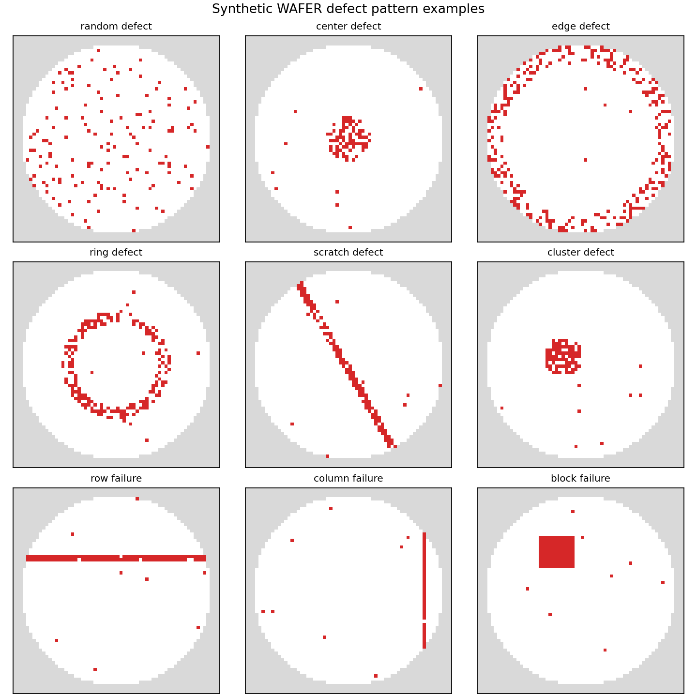
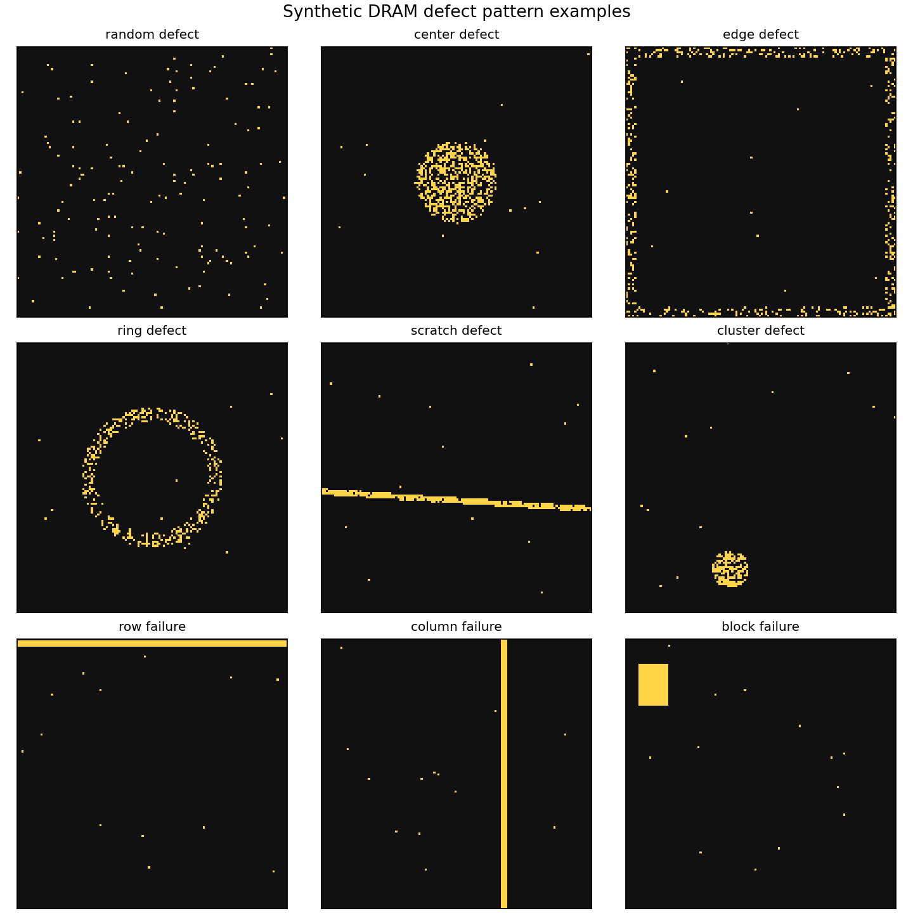
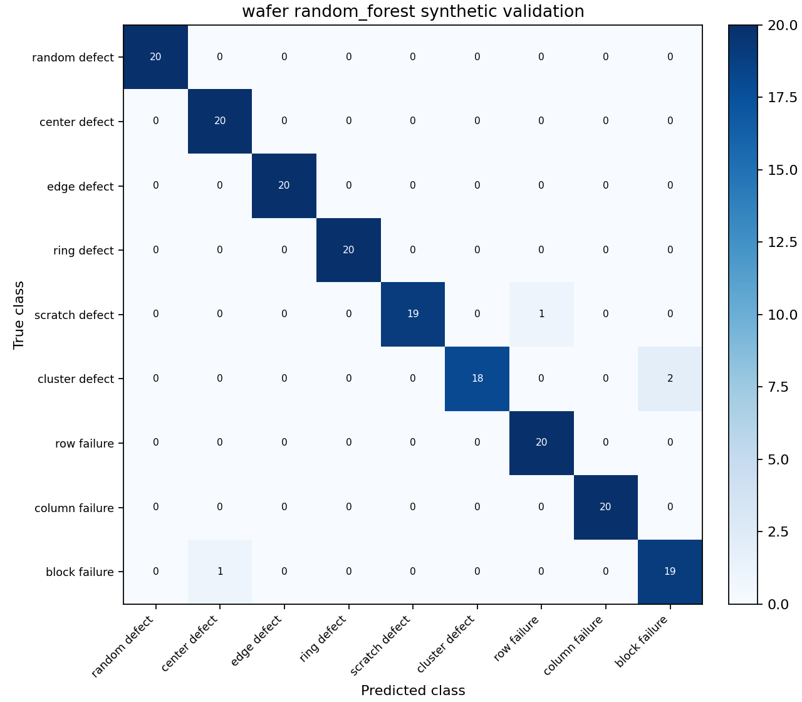
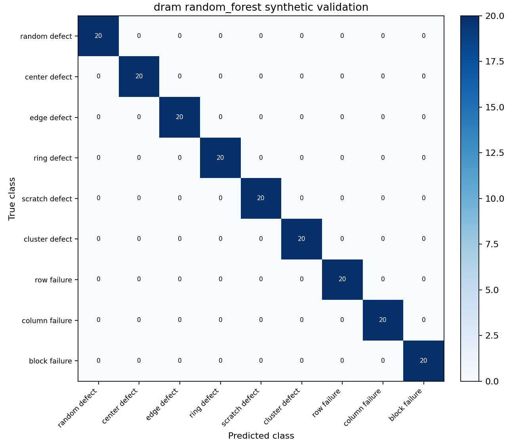
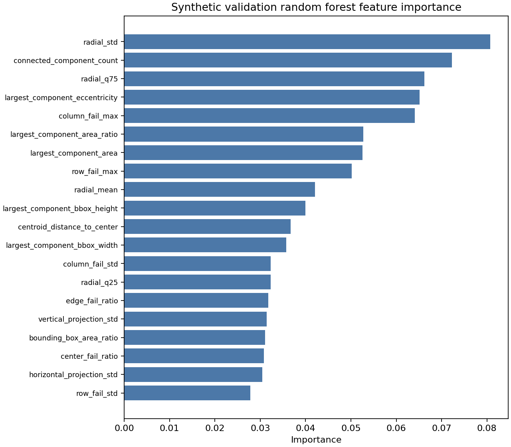
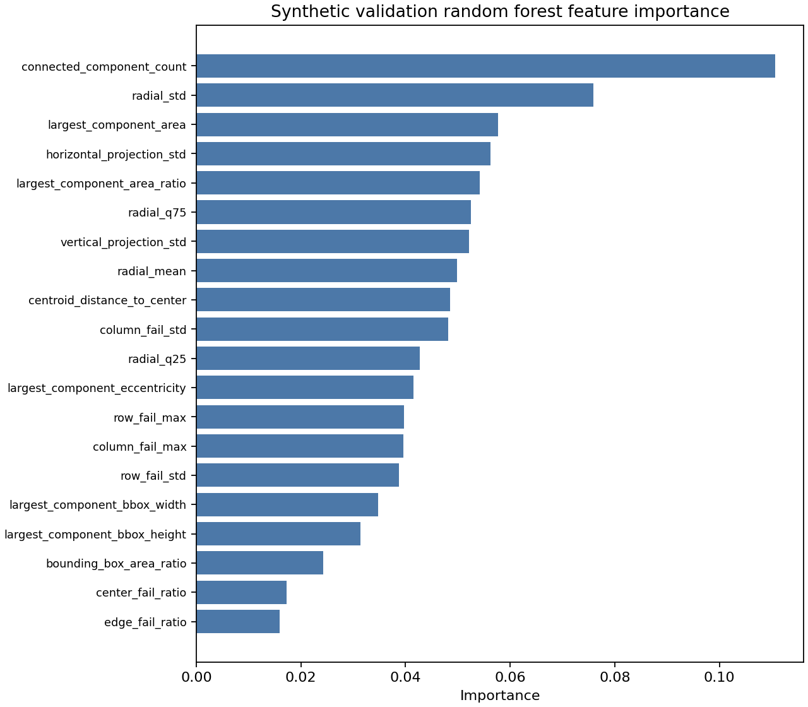

# Wafer Map and DRAM Fail Bit Map Defect Classification

Synthetic prototype for defect-pattern classification across two semiconductor
inspection views:

- **Wafer map**: die-level spatial defect distribution across one wafer.
- **DRAM fail bit map**: bit/address-level fail distribution inside one memory
  array.

This project uses synthetic data only. It is built to demonstrate an engineering
workflow: data simulation, feature engineering, classical machine learning,
artifact generation, and careful interpretation. It does not claim real fab or
production performance.

## Portfolio Quick Links

* [Technical Report](reports/wafer_dram_defect_classification_report.md)
* [Model Results Summary](reports/model_results_summary.md)
* [Figures Directory](reports/figures/)
* [Metrics Directory](reports/metrics/)

## Visual Results Preview

### Synthetic wafer defect examples



### Synthetic DRAM fail bit map examples



### Wafer random forest confusion matrix



### DRAM random forest confusion matrix



### Wafer random forest feature importance



### DRAM random forest feature importance



## Project Overview

The prototype generates synthetic defect maps for nine defect classes, extracts
interpretable spatial features, and trains separate classical models for wafer
maps and DRAM fail bit maps.

The frozen public workflow uses:

- `numpy`, `pandas`, `scikit-image`, and `scikit-learn`
- Logistic regression and random forest classifiers
- Matplotlib figures
- No PyTorch or CNN dependency

The committed model artifacts are tied to the locked Python 3.12 environment
documented in [MODEL_COMPATIBILITY.md](MODEL_COMPATIBILITY.md).

## Why Wafer Map and DRAM Fail Bit Map Are Different

A **wafer map** is a die-level view. Each pixel-like cell represents a die
position on the wafer. The wafer is circular, so the outside-wafer area is
masked with value `-1` and ignored during feature extraction.

A **DRAM fail bit map** is an array-level view. Each cell represents a bit or
address location inside one rectangular memory array. The full rectangular grid
is valid, and failures such as row, column, and block failures map naturally to
memory-array structures.

The project therefore trains wafer and DRAM models separately by default.
Mixing them into one model would blur two different physical meanings.

## Synthetic Data Disclosure

All data, labels, figures, model artifacts, and metrics in this repository are
synthetic. They are useful for engineering-method validation and portfolio
discussion, but they do not represent real semiconductor manufacturing data.

Use interview-safe wording:

- "This is a synthetic prototype."
- "The goal is engineering workflow validation."
- "The results show separability of generated patterns, not production
  readiness."
- "Real deployment would require fab/test data, process context, drift checks,
  and domain review."

Avoid saying:

- "Production ready"
- "Validated on real fab data"
- "Proves real DRAM yield improvement"

## Defect Classes

The synthetic generator currently supports nine classes:

1. random defect
2. center defect
3. edge defect
4. ring defect
5. scratch defect
6. cluster defect
7. row failure
8. column failure
9. block failure

These are generated for both map types, while row/column/block failures are
especially meaningful for DRAM fail bit maps.

## Project Structure

```text
wafer-defect-classification/
├─ configs/
│  ├─ default.yaml
│  └─ defect_classes.yaml
├─ data/
│  ├─ synthetic/
│  │  ├─ wafer_maps/
│  │  └─ dram_fail_bitmaps/
│  ├─ processed/
│  └─ splits/
├─ models/
├─ reports/
│  ├─ figures/
│  ├─ metrics/
│  ├─ model_results_summary.md
│  └─ wafer_dram_defect_classification_report.md
├─ src/
│  └─ wafer_defect_classification/
│     ├─ cli.py
│     ├─ preprocessing.py
│     ├─ features.py
│     ├─ train.py
│     ├─ predict.py
│     ├─ evaluate.py
│     ├─ visualization.py
│     └─ synthetic/
│        ├─ wafer_maps.py
│        └─ dram_fail_bitmaps.py
└─ tests/
```

## Setup Commands for Windows PowerShell

The public package does not include a virtual environment. Create a clean
Python 3.12 environment and install the exact dependency versions:

```powershell
# Run the following commands from the repository root.
py -3.12 -m venv .venv
.\.venv\Scripts\python.exe -m pip install --upgrade pip
.\.venv\Scripts\python.exe -m pip install -r requirements-lock.txt
.\.venv\Scripts\python.exe -m pip install -e . --no-deps
```

The committed `.joblib` files were generated with Python 3.12.8 and the full
lock in `requirements-lock.txt`. `requirements.txt` lists the direct project
dependencies only. See
[MODEL_COMPATIBILITY.md](MODEL_COMPATIBILITY.md) before loading them in another
environment.

## Data Generation Commands

```powershell
.\.venv\Scripts\python.exe -m wafer_defect_classification.cli generate --map-type wafer
.\.venv\Scripts\python.exe -m wafer_defect_classification.cli generate --map-type dram
.\.venv\Scripts\python.exe -m wafer_defect_classification.cli generate --map-type both
```

Generated datasets:

- `data/synthetic/wafer_maps/wafer_maps.npz`
- `data/synthetic/dram_fail_bitmaps/dram_fail_bitmaps.npz`

Each dataset contains:

- `maps`
- `labels`
- `class_names`

Wafer maps also include a `wafer_mask` and use `-1` for outside-wafer cells.

## Training Commands

Train wafer and DRAM models separately:

```powershell
.\.venv\Scripts\python.exe -m wafer_defect_classification.cli train --map-type wafer --model logistic_regression
.\.venv\Scripts\python.exe -m wafer_defect_classification.cli train --map-type wafer --model random_forest
.\.venv\Scripts\python.exe -m wafer_defect_classification.cli train --map-type dram --model logistic_regression
.\.venv\Scripts\python.exe -m wafer_defect_classification.cli train --map-type dram --model random_forest
```

Train all classical models for both map types:

```powershell
.\.venv\Scripts\python.exe -m wafer_defect_classification.cli train --map-type both --model all
```

## Prediction Commands

The `predict` entry loads a saved model, validates a `.npy`, `.npz`, or
single-map `.csv` input, extracts the same feature set used during training, and
writes JSON or CSV predictions.

Predict the committed wafer batch and save JSON:

```powershell
.\.venv\Scripts\python.exe -m wafer_defect_classification.cli predict `
  --model-path models\wafer_random_forest.joblib `
  --input data\synthetic\wafer_maps\wafer_maps.npz `
  --array-key maps `
  --output reports\wafer_random_forest_predictions.json
```

Predict the committed DRAM batch and save CSV:

```powershell
.\.venv\Scripts\python.exe -m wafer_defect_classification.cli predict `
  --model-path models\dram_random_forest.joblib `
  --input data\synthetic\dram_fail_bitmaps\dram_fail_bitmaps.npz `
  --array-key maps `
  --output reports\dram_random_forest_predictions.csv
```

Input rules:

- `.npy`: one 2D map or a 3D batch `(n_samples, height, width)`
- `.npz`: map array stored under `--array-key`, default `maps`
- `.csv`: one 2D numeric map
- output: `.json` or `.csv`

Prediction output remains synthetic-prototype evidence only. It does not
constitute validation on real fab, wafer-sort, CP, final-test, or inline
inspection data.

## Test Commands

Use a dynamic pytest temp directory on Windows to avoid stale temp-folder
permission issues:

```powershell
# Run the following commands from the repository root.
$run = ".tmp\pytest_" + (Get-Date -Format "yyyyMMdd_HHmmss")
.\.venv\Scripts\python.exe -m pytest --basetemp=$run -p no:cacheprovider
```

## Generated Artifacts

Model files:

- `models/wafer_logistic_regression.joblib`
- `models/wafer_random_forest.joblib`
- `models/dram_logistic_regression.joblib`
- `models/dram_random_forest.joblib`

Metrics:

- `reports/metrics/wafer_logistic_regression_metrics.json`
- `reports/metrics/wafer_random_forest_metrics.json`
- `reports/metrics/dram_logistic_regression_metrics.json`
- `reports/metrics/dram_random_forest_metrics.json`

Figures:

- `reports/figures/wafer_sample_grid.png`
- `reports/figures/dram_sample_grid.png`
- Confusion matrices for each trained model
- Random forest feature importance plots
- Logistic regression coefficient magnitude plots

Split files:

- `data/splits/wafer_splits.json`
- `data/splits/dram_splits.json`

## Current Synthetic Prototype Metrics

These values are rounded test-set metrics on generated synthetic data only.

| Map Type | Model | Accuracy | Macro F1 |
|---|---:|---:|---:|
| wafer | logistic_regression | 0.967 | 0.967 |
| wafer | random_forest | 0.978 | 0.978 |
| dram | logistic_regression | 0.983 | 0.983 |
| dram | random_forest | 1.000 | 1.000 |

The DRAM random forest score of `1.000` should be interpreted carefully: the
synthetic classes are cleanly separable. This does not imply real production
performance.

## Frozen Public Package

This public package intentionally excludes local or private development
artifacts:

- `.venv/`
- `.tmp/`
- `.git/`
- `_private_notes/`
- `__pycache__/`

It retains the source code, configuration, synthetic datasets, trained model
artifacts, representative figures, metrics, reports, and tests required to
review and reproduce the prototype. File hashes are recorded in
`SHA256SUMS.txt`, and the included-file inventory is recorded in
`PUBLIC_PACKAGE_MANIFEST.md`.

## Limitations

- Data is synthetic and generated from simple geometric rules.
- Models may learn generator-specific artifacts.
- No real fab, wafer sort, CP, final test, or inline inspection data is used.
- No temporal drift, equipment drift, lot-to-lot variation, or process recipe
  context is modeled.
- CNN support is not included in this frozen public release.
- The project is a prototype for engineering思路验证, not a production system.

## Interview-Safe Wording

Good wording:

- "I built a synthetic prototype to show the full AI workflow for wafer map and
  DRAM fail bit map defect classification."
- "The metrics are synthetic validation metrics, so I do not present them as
  fab performance."
- "The value is in separating map semantics, designing interpretable features,
  and building a reproducible pipeline."
- "For a real deployment, I would need labeled production data, process
  metadata, failure analysis feedback, and monitoring after deployment."

Short pitch:

> This is a synthetic prototype for semiconductor defect-pattern
> classification. It separates wafer-level die maps from DRAM array-level fail
> bit maps, generates representative defect patterns, extracts interpretable
> spatial features, and trains classical models as a baseline. I use it to show
> AI plus process-optimization thinking, not to claim real manufacturing
> performance.
